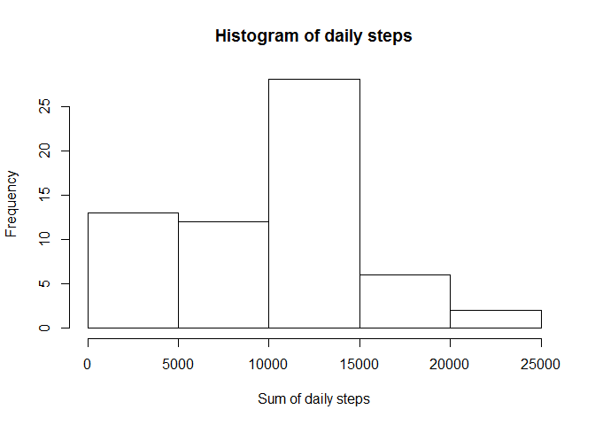
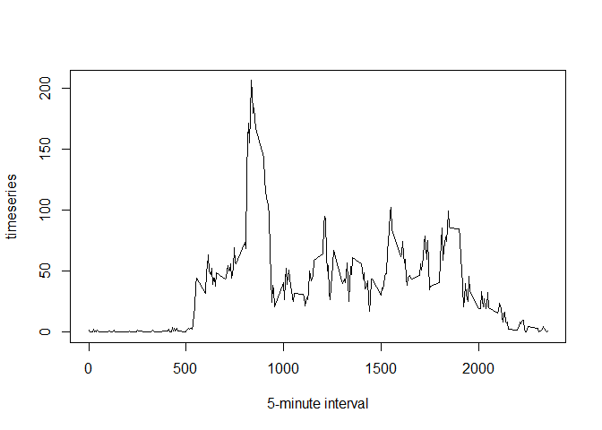
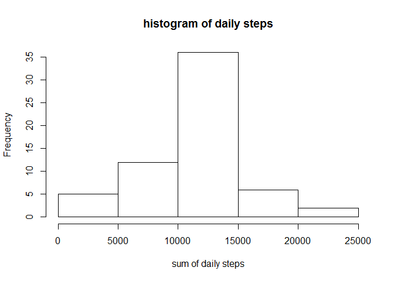

# Reproducible Research: Course Project 1
Dylan Woon  
May 28, 2016  


## Introduction

It is now possible to collect a large amount of data about personal movement using activity monitoring devices such as a Fitbit, Nike Fuelband, or Jawbone Up. These type of devices are part of the "quantified self" movement - a group of enthusiasts who take measurements about themselves regularly to improve their health, to find patterns in their behavior, or because they are tech geeks. But these data remain under-utilized both because the raw data are hard to obtain and there is a lack of statistical methods and software for processing and interpreting the data.

This assignment makes use of data from a personal activity monitoring device. This device collects data at 5 minute intervals through out the day. The data consists of two months of data from an anonymous individual collected during the months of October and November, 2012 and include the number of steps taken in 5 minute intervals each day.

The data for this assignment can be downloaded from the course web site:

Dataset link: https://d396qusza40orc.cloudfront.net/repdata%2Fdata%2Factivity.zip , size: [52K]

The variables included in this dataset are:

* steps: Number of steps taking in a 5-minute interval (missing values are coded as NA)
* date: The date on which the measurement was taken in YYYY-MM-DD format
* interval: Identifier for the 5-minute interval in which measurement was taken

The dataset is stored in a comma-separated-value (CSV) file and there are a total of 17,568 observations in this dataset.

# Let's begin! 

First of all, load the data and have a quick look at it using head(), summary() and str().


```r
data <- read.csv("./Coursera Assignment/Module 5 Week 2/activity.csv", 
        header = TRUE, stringsAsFactors = FALSE)
head(data)
```

```
##   steps       date interval
## 1    NA 2012-10-01        0
## 2    NA 2012-10-01        5
## 3    NA 2012-10-01       10
## 4    NA 2012-10-01       15
## 5    NA 2012-10-01       20
## 6    NA 2012-10-01       25
```

```r
summary(data)
```

```
##      steps            date              interval     
##  Min.   :  0.00   Length:17568       Min.   :   0.0  
##  1st Qu.:  0.00   Class :character   1st Qu.: 588.8  
##  Median :  0.00   Mode  :character   Median :1177.5  
##  Mean   : 37.38                      Mean   :1177.5  
##  3rd Qu.: 12.00                      3rd Qu.:1766.2  
##  Max.   :806.00                      Max.   :2355.0  
##  NA's   :2304
```

```r
str(data)
```

```
## 'data.frame':	17568 obs. of  3 variables:
##  $ steps   : int  NA NA NA NA NA NA NA NA NA NA ...
##  $ date    : chr  "2012-10-01" "2012-10-01" "2012-10-01" "2012-10-01" ...
##  $ interval: int  0 5 10 15 20 25 30 35 40 45 ...
```

```r
## Format: Disable scientific notation and decimals
options(scipen=999, digits = 0)
```


# Question 1: What is mean total number of daily steps taken?

* Make a histrogram of the total daily steps
* Missing values can be removed
* Report its mean & median


```r
# Calculate the total daily steps.
dailysum <- tapply(data$steps, data$date, sum, na.rm = TRUE)
hist(dailysum, xlab = "Sum of daily steps", main = "Histogram of daily steps")
```

<!-- -->

```r
mean.dailysum <- mean(dailysum)
median.dailysum <- median(dailysum)
mean.dailysum
```

```
## [1] 9354
```

```r
median.dailysum
```

```
## [1] 10395
```

```r
# The mean total number of daily steps taken is `r mean.dailysum`. 
# The median total number of daily steps taken is `r median.dailysum`.
```
## Response
The mean total number of daily steps taken is 9354. 
The median total number of daily steps taken is 10395.


# Question 2: What is the average daily activity pattern?

Make a time series plot (i.e. type = "l") of the 5-minute interval (x-axis) and the average number of steps taken, averaged across all days (y-axis)


```r
timeseries <- tapply(data$steps, data$interval, mean, na.rm = TRUE)
plot(timeseries ~ unique(data$interval), type="l", xlab = "5-minute interval")
```

<!-- -->


Which 5-minute interval, on average across all the days in the dataset, contains the maximum number of steps?


```r
timeseries[which.max(timeseries)]
```

```
## 835 
## 206
```

## Response
The 835 of 5-minute interval has a maximum number of 206.2 steps.

Well...

There are a number of days/intervals where there are missing values (coded as NA). The presence of missing days may introduce bias into some calculations or summaries of the data. 

Let's determine the number of NA's.


```r
tableNA <- table(is.na(data))
tableNA
```

```
## 
## FALSE  TRUE 
## 50400  2304
```

There are 2304 NA's. All of them are located in the steps variable.

To improve reliablity of result, the mean of steps of the interval is used to replace their respective NA's.


```r
data.withoutNA <- data  

for (i in 1:nrow(data)){
    if(is.na(data$steps[i])){
        data.withoutNA$steps[i]<- timeseries[[as.character(data[i, "interval"])]]
    }
}
tableNA2 <- table(is.na(data.withoutNA))
tableNA2
```

```
## 
## FALSE 
## 52704
```

There is zero TRUE statement for NA, i.e the new dataset has no more NA's.

Make a histogram of the total number of steps taken each day.


```r
dailysum2 <- tapply(data.withoutNA$steps, data.withoutNA$date, sum, na.rm = TRUE)
hist(dailysum2, xlab = "sum of daily steps", main = "histogram of daily steps")
```

<!-- -->

```r
mean.dailysum2 <- mean(dailysum2)
median.dailysum2 <- median(dailysum2)
mean.dailysum2
```

```
## [1] 10766
```

```r
median.dailysum2
```

```
## [1] 10766
```

```r
# The mean total number of daily steps taken is `r mean.dailysum2`. 
# The median total number of daily steps taken is `r median.dailysum2`.)
```

## Response
The mean total number of daily steps taken is 10766. The median total number of daily steps taken is 10766.

After imputing the NA's,

* The new mean and median values become higher than the original data set.
* They have the same values.


# Question 3: Are there differences in activity patterns between weekdays and weekends?

The dataset with the filled-in missing values is used.

We would like to find out how many weekdays and weekends in the dataset.


```r
# Create a "weekday" column throughout the new dataset (without NA's)
data.withoutNA$weekday <- c("weekday")

# Identify the weekends within the new data
weekend <- weekdays(as.Date(data.withoutNA[, 2])) %in% c("Saturday", "Sunday")

# Throughout the identified weekends, overwrite the "weekday" columns with "weekend"  
data.withoutNA[weekend, ][4] <- c("weekend")

# Compare the number of weekdays and weekends.
table(data.withoutNA$weekday == "weekend")
```

```
## 
## FALSE  TRUE 
## 12960  4608
```

So, there are 12960 weekdays (FALSE) and 4608 weekends (TRUE).

Determine the mean values for each unique interval of weekday and weekend.


```r
# Subset the data with identified weekday and weekend.
data.withoutNA.weekday <- subset(data.withoutNA, data.withoutNA$weekday == "weekday")
data.withoutNA.weekend <- subset(data.withoutNA, data.withoutNA$weekday == "weekend")

# Factorize the weekday and weekend for graph plotting later
# Factor() is required since weekday and weekend are just characters.
data.withoutNA$weekday <- factor(data.withoutNA$weekday)

# Calculate the mean values for each unique interval
mean.data.withoutNA.weekday <- tapply(data.withoutNA.weekday$steps, 
                                      data.withoutNA.weekday$interval, mean)
mean.data.withoutNA.weekend <- tapply(data.withoutNA.weekend$steps, 
                                      data.withoutNA.weekend$interval, mean)
```

The final data below consists of: 
* unique intervals
* one mean value of each unique interval
* specifying weekday or weekend


```r
final_weekday <- data.frame(interval = unique(data.withoutNA.weekday$interval),
                            avg = as.numeric(mean.data.withoutNA.weekday), 
                            day = rep("weekday", length(mean.data.withoutNA.weekday)))

final_weekend <- data.frame(interval = unique(data.withoutNA.weekend$interval),
                            avg = as.numeric(mean.data.withoutNA.weekend),
                            day = rep("weekend", length(mean.data.withoutNA.weekend)))

final <- rbind(final_weekday, final_weekend)
```

Make two time series plots to observe the differences in activity patterns between weekdays and weekends.


```r
library(lattice)
xyplot(avg ~ interval | day, data = final, layout = c(1, 2),
       type = "l", ylab = "Number of steps")
```

<!-- -->

## Response
Both plots do not have much difference. Both peak at the 750-950 time period, indicating that more steps are involved during that period irrespective of the days in a week.
